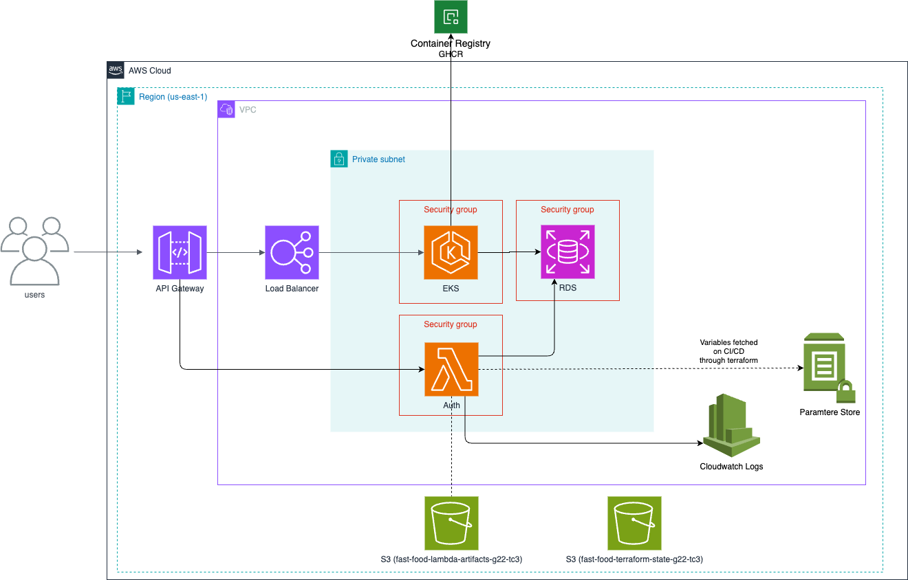
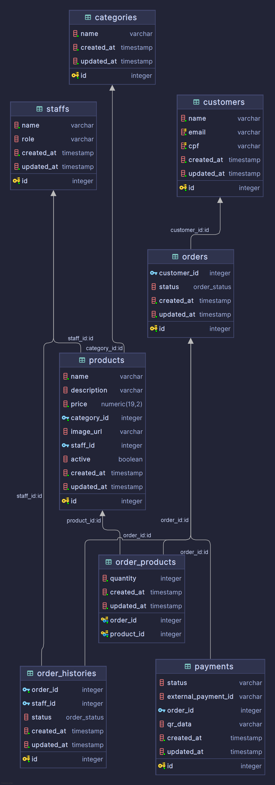

<a name="readme-top"></a>

# <p align="center"><b>Fast Food</b> <small>FIAP Tech Challenge 3 - G22 - RDS + TF</small></p>

<p align="center">
    
    
    
    
</p>


## 💬 About

Repository for the [FIAP](https://postech.fiap.com.br/) Tech Challenge 3, where we will deploy AWS RDS using terraform.

> [!NOTE]
> Tech Challenge 3 API repository can be found [here](https://github.com/FIAP-SOAT-G20/fiap-tech-challenge-3-api)  

## :bulb: Motivation

A relational database was chosen as the optimal solution for this project based on our requirements analysis, which indicated that the data structure would remain relatively stable over time.

For the specific database selection, we evaluated PostgreSQL and MySQL as potential candidates. PostgreSQL was ultimately selected based on the team's technical expertise and familiarity with the platform. This decision was further supported by the fact that both options had comparable cloud deployment costs, making PostgreSQL the most efficient choice for our needs.

## :art: Architecture

<p align="center">
  
</p>

### Database Schema

<p align="center">
  
</p>

## :computer: Technologies

- [Terraform](https://www.terraform.io/)

## :scroll: Requirements

### Build/Run Locally (development)

- [Terraform](https://www.terraform.io/)


<p align="right">(<a href="#readme-top">back to top</a>)</p>

## :cd: Installation

```sh
git clone https://github.com/FIAP-SOAT-G20/fiap-tech-challenge-3-db-tf.git
```

```sh
cd fiap-tech-challenge-3-db-tf
```

<p align="right">(<a href="#readme-top">back to top</a>)</p>

## :runner: Running

### :gear: Terraform

Place the variable values ​​in the `terraform.tfvars` file and run the following commands:

```bash
make tf-init
```
```bash
make tf-plan
```
```bash
make tf-apply
```

<p align="right">(<a href="#readme-top">back to top</a>)</p>

## :busts_in_silhouette: Contributors

<div align="center">
  <table>
    <tbody>
      <tr>
        <td align="center" valign="top" width="14.28%"><a href="https://github.com/atomaz"><br /><sub><b>Alice Tomaz</b></sub></a><br />
        <td align="center" valign="top" width="14.28%"><a href="https://github.com/filipe1309"><br /><sub><b>Filipe Leuch Bonfim</b></sub></a><br />
        <td align="center" valign="top" width="14.28%"><a href="https://github.com/hugokishi"><br /><sub><b>Hugo Kishi</b></sub></a><br />
        <td align="center" valign="top" width="14.28%"><a href="https://github.com/marcos-nsantos"><br /><sub><b>Marcos Santos</b></sub></a><br />
      </tr>
    </tbody>
  </table>
</div>

<p align="right">(<a href="#readme-top">back to top</a>)</p>